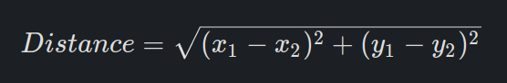
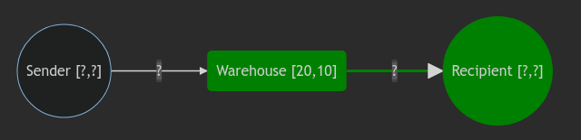
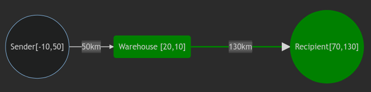
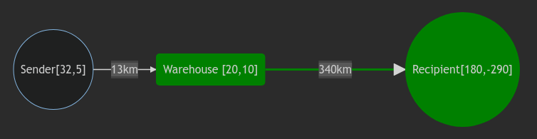

You may recognise the `Parcel` class (in `parcel` folder) from the mid-semester exam, it has been modified slightly for the purpose of this exercise and now contains the following fields:

- `id`: an integer that identifies the parcel
- `weight`: the weight of the parcel
- `allowedDays`: the maximum allowed days for the parcel to be delivered
- `sender`: the sender of the parcel
- `recipient`: the recipient of the parcel

The `sender` and `recipient` fields are now of type class `Person` which has the following field:

- `location`: the location of the person denoted by an X and Y coordinate in kilometres

All parcels must pass through a common warehouse located at **\[20,10\]** (as seen in general case below). Distance is calculated using the standard Euclidean distance:

**General case:**

**Example 1:** Sender is at position [-10,50], Recipient is at position [70,130]

**Example 2:** Sender is at position [32,5], Recipient is at position [180,-290]

* * *
**For Tasks 1 and 2:** Some test cases are provided in `ParcelTreeTest` to assist your understanding, but it does not guarantee you will get full marks. Remember that we use different test cases to mark your solution. You are free to add your own test cases to increase your confidence that your solution is robust.

* * *

## Task 1:

Impose a 'natural order' on `Parcel` using the `CompareTo` method in the `Parcel` class. The ordering of parcels to be implemented is defined by:

- The **distance from the Warehouse to the Recipient** (highlighted in green in the above image) is in **ascending** order

Hence since 130km is less than 340km, then we know that the parcel in Example 1 should come before the parcel in Example 2.

The `CompareTo(Parcel other)` method compares two parcels. If the `other` parcel should come **before** `this` parcel then the `CompareTo` method should return a **positive** `int`. Conversely, if the `other` parcel should come **after** `this` parcel then the `CompareTo` method should return a **negative** `int`. And finally, if the ordering between two parcels is arbitrary (ie. if the relevant distance is equal) then the `CompareTo` method should return **zero**.

**Hint:** The `getDistance` method in the `CartesianCoordinate` class might be helpful.

You are only allowed to add methods and variables to the `Parcel.java` file for this task, do not change the class structure.

## Task 2:

Create an **Iterator** that implements a **pre-order walk** over a Binary Search Tree of parcels. The class for the iterator is already created for you (see inner class `IteratorPreOrder` in the `ParcelBST`), your job is to implement the methods `hasNext()` and `next()`.

You may recognise the implementation of the immutable `BinarySearchTree` class from your labs. The `ParcelBST` class is essentially a `BinarySearchTree` that holds Parcels.
Your iterator implementation needs to somehow store which Parcel it is up to. When the method `next()` is called, your iterator implementation should return the next parcel in the pre-order walk.

If `next()` is called and there are no parcels left in the iteration, then it should throw a new instance of [`NoSuchElementException`](https://docs.oracle.com/javase/8/docs/api/java/util/NoSuchElementException.html). The `hasNext()` method should return `true` if there are parcels left in the iteration and `false` if not.

You are only allowed to add methods and variables to the `ParcelBST.java` file for this task, do not change the class structure.

* * *
* * *

#### You are expected to complete:

- `CompareTo` method in the `Parcel.java` class (Task 1)
- `hasNext()` and `next()` methods in `ParcelBST.java` (Task 2)

#### You are expected to upload:
- `Parcel.java`
- `ParcelBST.java`
